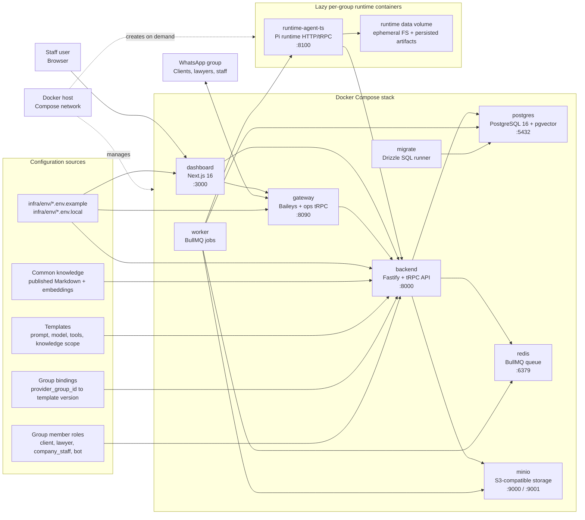

# Kuuna Support Agents

Staff-operated WhatsApp group agents with sandboxed runtimes, deterministic routing, and dashboard-based governance.

## Status
This repository contains the TypeScript implementation for the Kuuna control plane, dashboard,
WhatsApp gateway, and runtime agent.

- PRD: `plan/mvp/PRD.md`
- Agent guides: `AGENTS.md`, `apps/dashboard/AGENTS.md`

The supported runtime path is Docker Compose. Development and production-like
Compose stacks live under `infra/compose/`.

## Environment Map



## MVP Overview
- One agent instance per WhatsApp group (strict 1:1 active binding)
- WhatsApp group gateway ingestion (messages + media)
- Group-triggered responses (mention/reply/prefix trigger)
- Sandboxed per-group runtime (ephemeral FS; persistence in DB/S3)
- RAG from:
  - group chat history
  - group-specific knowledge
  - common knowledge
- Dashboard for staff to:
  - manage templates, agents, and bindings
  - manage prompts and knowledge (draft/publish/rollback)
  - manage staff users (no self-registration)

## Tech Stack
- **Dashboard:** Next.js 16 + TypeScript
- **Control Plane:** TypeScript Fastify + tRPC + Drizzle
- **Agent runtime framework:** TypeScript Pi runtime
- **WhatsApp gateway:** Baileys
- **DB:** PostgreSQL 16 + pgvector + RLS
- **Queue:** Redis + BullMQ
- **Storage:** S3-compatible object storage
- **Observability:** Sentry + structured JSON logs
- **Deployment:** Docker Compose on single host

## Product Principles
- Deterministic routing (`provider_group_id` => exactly one active agent binding)
- Full auditability (append-only audit events)
- Versioned prompts and knowledge with controlled publish/rollback
- Group template as source of truth for tools/model/egress policy
- Strong data traceability via end-to-end trace IDs

## Security and Operations (MVP)
- Staff-only dashboard
- Local login (admin-created users, forced password change on first login)
- Brute-force protections (rate limit + lockout)
- Tool execution with template policy and hard timeouts
- Error monitoring via Sentry
- Gateway operations surface for WhatsApp session status, QR login, and group metadata

## Sentry Setup (Current)
- Sentry org default is configured in repo root `.sentryclirc`:
  - org: `calumba`
- Service-specific Sentry projects are configured:
  - Backend: `kuuna-backend`
  - Dashboard: `kuuna-dashboard`
  - Gateway: `kuuna-gateway`
- Service-local `.sentryclirc` defaults:
  - `apps/dashboard/.sentryclirc`
  - `services/gateway/.sentryclirc`
- DSNs are pre-wired in dev env templates:
  - `infra/env/backend.env.example` (backend project DSN)
  - `infra/env/dashboard.env.example` (dashboard project DSN)
  - `infra/env/gateway.env.example` (gateway project DSN)
- Backend and gateway send scrubbed events (metadata-only intent).
- Dashboard initializes Sentry for client/server/edge via `@sentry/nextjs`.

## Repository Layout
- `apps/dashboard` - Next.js 16 + TypeScript dashboard
- `services/backend-ts` - TypeScript control plane API and worker
- `services/gateway` - TypeScript WhatsApp gateway using Baileys
- `services/runtime-agent-ts` - TypeScript Pi runtime agent image used for lazy per-group containers
- `packages/api-client-ts` - shared typed backend API client and dashboard read models
- `packages/contracts` - shared gateway/event contracts
- `packages/agent-contracts` - shared runtime request/result contracts
- `packages/pi-runtime` - shared Pi runtime adapter, model, prompt, and tool logic
- `infra` - Compose files, environment templates, and smoke scripts
- `docs` - architecture notes, runbooks, and ADRs

## Setup Guide

### Prerequisites
- Docker with Docker Compose v2
- `just`
- `pnpm` 10.33.2 for host-side monorepo commands

No Python service stack is required. Runtime templates may allow Python as an
agent tool command, but the application codebase itself is TypeScript.

### Environment Files
The Compose stacks load checked-in examples first, then optional local overrides:

- Backend: `infra/env/backend.env.example`, `infra/env/backend.env.local`
- Dashboard: `infra/env/dashboard.env.example`, `infra/env/dashboard.env.local`
- Gateway: `infra/env/gateway.env.example`, `infra/env/gateway.env.local`

Create `*.env.local` files only for machine-specific secrets and overrides. They
are ignored by git.

Useful local overrides:

- `OPENAI_API_KEY` in `infra/env/backend.env.local` for embeddings, retrieval query vectors, and audio/video transcription
- `PI_TRANSPORT=websocket-cached` for pi's cached OpenAI WebSocket transport
- `PI_AUTH_HOST_PATH=$HOME/.pi/agent/auth.json` to mount credentials created by `pi` `/login` into runtime containers
- `AGENT_MENTION_IDS` in `infra/env/backend.env.local` for the real bot JID(s)
- `DASHBOARD_REQUIRED_ADMIN_PASSWORD` in both backend and dashboard local env files
- `GATEWAY_SERVICE_TOKEN`, `GATEWAY_OPS_TOKEN`, and `INTERNAL_OPS_TOKEN` when testing token enforcement

### Pi ChatGPT Auth
The runtime can use Pi credentials created by signing in to ChatGPT from Pi.
Run Pi locally once, then log in with the ChatGPT Plus/Pro (Codex) provider:

```bash
pnpm exec pi
```

Inside Pi:

```text
/login
/settings
```

In `/login`, select `ChatGPT Plus/Pro (Codex)`. In `/settings`, set
`transport` to `websocket-cached`.

Then mount the generated Pi auth file into managed runtime containers from
`infra/env/backend.env.local`:

```bash
OPENAI_API_KEY=sk-...
PI_TRANSPORT=websocket-cached
PI_AUTH_HOST_PATH=$HOME/.pi/agent/auth.json
PI_AUTH_CONTAINER_PATH=/runtime-data/pi-auth.json
```

This setup is intentionally split:

- Agent LLM calls use the mounted Pi ChatGPT login only.
- Image and video-preview media analysis use the mounted Pi ChatGPT login only.
- Embeddings, retrieval query vectors, and audio/video transcription use
  `OPENAI_API_KEY` only.

Do not use `OPENAI_API_KEY` as an agent LLM fallback. The runtime does not
register it as an agent model credential, does not switch agent or image-preview
analysis calls to API-key billing, and requires the mounted Pi auth file for
agent LLM execution. If the key is empty, embeddings fall back to local
pseudo-embeddings and audio/video transcription fails explicitly with
`audio_transcription_requires_openai_api_key`.

### Development Start
Run the full development stack from the repository root:

```bash
just up
```

(or via pnpm wrapper: `pnpm dev`)

`just up` first builds `kuuna-runtime-agent-ts:dev`, then runs:

```bash
docker compose -f infra/compose/docker-compose.dev.yml up --build
```

The dev stack starts:

- `node-deps` - installs workspace dependencies into Docker volumes
- `migrate` - runs Drizzle migrations
- `backend` - Fastify/tRPC API on http://localhost:8000
- `worker` - BullMQ background worker
- `gateway` - Baileys gateway and ops API on http://localhost:8090
- `dashboard` - Next.js dev server on http://localhost:3000
- `postgres` - PostgreSQL 16 with pgvector on localhost:5432
- `redis` - Redis on localhost:6379
- `minio` - S3-compatible storage on http://localhost:9001

Hot reload is enabled for dashboard, backend, worker, and gateway through
bind-mounted source code.

Use the development stack only for local development. It runs the dashboard with
`next dev` and runs backend, worker, and gateway in watch mode, so it is not the
intended remote/server deployment mode.

The runtime agent is not a shared Compose service in development. The worker
lazily creates one managed runtime container per `provider_group_id` when that
chat first needs agent work.

Stop the dev stack:

```bash
just down
```

Follow logs:

```bash
just logs
just logs-service gateway
```

Run migrations manually:

```bash
just migrate
```

Reset the persisted WhatsApp gateway session:

```bash
just reset-whatsapp-session
```

### First Login and WhatsApp Pairing
The default development admin is configured through the env templates:

- Email: `admin@kuuna.ai`
- Password: `admin123456!`

Set a local password override before first start if you do not want to use the
default. On first sign-in, the dashboard requires a password change.

For WhatsApp pairing, open the gateway logs or the dashboard gateway operations
UI and scan the QR code. The Baileys auth state is stored in the
`kuuna-dev_gateway_session` Docker volume.

### Dashboard Configuration
After the stack is running and the WhatsApp gateway is paired, configure the
agent from the dashboard in this order:

1. Create public company knowledge.
2. Create and publish a template.
3. Bind the template to a WhatsApp group.
4. Sync group members and assign group roles where client-specific context is needed.

Publishing knowledge, publishing templates, binding groups, and changing group
member roles require an `owner` or `admin` dashboard user.

#### Public Knowledge
Public knowledge is called **Common knowledge** in the dashboard. It is
company-wide process knowledge that any template may use when its knowledge
settings allow it. Chat ingestion never writes Common knowledge.

Open `Knowledge` -> `Common`. If the Common scope is empty, use **Create
Cyberheld defaults**. This creates, publishes, and queues indexing for four
default Markdown files from `plan/mvp/common-knowledge-cyberheld/`:

- `cyberheld-company-positioning.md` with doc key `cyberheld-company-positioning`:
  company profile, positioning, boundaries, and what Cyberheld is allowed to say.
- `cyberheld-intake-and-evidence-workflow.md` with doc key
  `cyberheld-intake-evidence-workflow`: intake flow, evidence handling, todos,
  and escalation behavior.
- `cyberheld-austrian-legal-context.md` with doc key
  `cyberheld-austrian-legal-context`: Austrian legal context for safe bot
  answers without replacing legal advice.
- `cyberheld-faq-and-client-communication.md` with doc key
  `cyberheld-faq-client-communication`: FAQ answers and client-friendly wording.

To add or update Common knowledge manually:

1. Create a Common document with a stable document key.
2. Open the document detail page.
3. Save a Markdown draft.
4. Publish the version.

Only the published version is used for retrieval. Publishing archives the
previous published version and indexes the new Markdown into retrieval chunks and
embeddings.

#### Templates
Templates define how an agent behaves. A template combines:

- System prompt: role, audience, tone, responsibilities, and boundaries.
- Model: the Pi OpenAI model used by this template.
- Tools: for example message history, media analysis, todos, knowledge search,
  chat history search, and optionally allowlisted bash commands.
- Knowledge access: all, selected, or no Common knowledge, plus all, selected, or
  no bound private group knowledge.
- Runtime image settings: optional Dockerfile instructions and optional bash
  allowlist for the isolated runtime image.

Create a template under `Templates` -> `New template`. After creating it, open
the template detail page and save the configuration. Saving creates a new
published template version and queues a Pi runtime image build for that version.

Use templates when different WhatsApp groups need different behavior. For
example, one template can answer client intake questions with Cyberheld process
knowledge, while another can run passive internal triage with todo creation and
no direct WhatsApp replies.

#### Binding Templates to Groups
A binding makes one WhatsApp group route to one published template version.
There can be only one active binding per `provider_group_id`.

You can bind from either:

- `Inbox` -> `Create` when creating or selecting a group.
- `Inbox` -> group -> `Settings` when the group has no active binding.

Choose a published template version and submit the bind request. The backend
creates the binding, provisions the runtime path, checks health, sends the
disclosure message, and marks the binding active. Unbinding stops routing
immediately, but messages, media, transcripts, and audit history stay available.

#### Group Member Roles
Group member roles are configured per WhatsApp group under `Inbox` -> group ->
`Settings` -> `WhatsApp members`. These are not dashboard staff roles. They
describe who a WhatsApp participant is inside that group.

Use **Sync participants** to import members from the paired WhatsApp gateway.
Then assign roles:

- `client`: the represented person or party. Client members can be linked to a
  client profile and, when exactly one client member is configured, marked as
  the primary client.
- `lawyer`: external or internal legal representative in the WhatsApp group.
- `company_staff`: Cyberheld or partner staff member.
- `bot`: the Kuuna bot identity. Gateway sync marks the current bot as `bot`
  automatically when it can identify itself.
- `Unassigned`: member was observed or synced, but is not categorized yet.

Roles help the system separate client, staff, lawyer, and bot context. They make
the group knowledge explorer filterable by source role and provide the optional
client-specific context needed for private retrieval. Setting a single primary
client is useful when a group should resolve private knowledge, todos, and
identity-linked context for one client profile instead of treating every message
as generic group context.

### Production-like Compose Start
The production-like stack uses production Dockerfiles and `NODE_ENV=production`.
It is started from the repository root:

```bash
just prod-up
```

This runs:

```bash
just prod-build
docker compose -f infra/compose/docker-compose.prod.yml up
```

The prod Compose file builds:

- `kuuna-runtime-agent-ts:prod`
- Dashboard standalone Next.js server
- Backend API runner image
- Backend worker runner image
- Gateway runner image

The production-like stack still starts local Postgres, Redis, and MinIO services
from `infra/compose/docker-compose.prod.yml`. Treat it as the current single-host
Compose deployment path, not as a managed-cloud deployment definition.

Prod service URLs on the host:

- Dashboard: http://localhost:3000
- Backend API: http://localhost:8000
- Gateway ops API: http://localhost:8090
- MinIO console: http://localhost:9001

### Remote Server Deployment Mode
On a remote single-host deployment, use the production Compose file. Do not use
`just up` or `infra/compose/docker-compose.dev.yml` for the staff dashboard on a
server; that starts the slower development server and watch-mode services.

For a detached remote start:

```bash
docker compose -f infra/compose/docker-compose.prod.yml up --build -d
```

Check which stack is active:

```bash
docker compose ls --all
docker ps --format 'table {{.Names}}\t{{.Image}}\t{{.Ports}}'
```

The active remote dashboard stack should show `kuuna-prod` containers. If
`kuuna-dev` containers are running, the server is using the development stack.

Expose the remote dashboard through Tailscale Serve, not direct public ports or
Tailscale Funnel. The committed helper owns the node-level Serve config for this
host:

```bash
infra/compose/tailscale-serve.cyberheld-ai-team.sh
```

Use this helper for the current node-level Serve setup. The newer
`tailscale serve set-config` file flow is for Tailscale Services and is not the
active deployment model for this host. The helper runs `tailscale serve reset`,
so only use it on a node where the Tailscale Serve config is owned by this
Kuuna deployment.

For the browser-side tRPC client and subscriptions to use this `/trpc` route,
set the dashboard build-time public API origin to the Tailscale HTTPS origin
before rebuilding the image:

```bash
export NEXT_PUBLIC_API_BASE_URL=https://cyberheld-ai-team.snapper-ide.ts.net
docker compose -f infra/compose/docker-compose.prod.yml up --build -d dashboard
```

`NEXT_PUBLIC_API_BASE_URL` is passed as a dashboard Docker build arg by Compose,
so it must come from the Compose environment or `.env` used for the build.
`infra/env/dashboard.env.local` is still useful for runtime dashboard env, but
does not by itself set the build arg.

Expected status:

```text
https://cyberheld-ai-team.snapper-ide.ts.net (tailnet only)
|-- /     proxy http://localhost:3000
|-- /trpc proxy http://localhost:8000/trpc
```

The root path serves the dashboard. The `/trpc` path is required for browser
tRPC subscriptions and is routed through the same Tailscale HTTPS origin instead
of exposing backend port `8000` directly. The target includes `/trpc` because
Tailscale Serve strips the matched path prefix before proxying. Do not use
Funnel for the staff dashboard unless the service is intentionally being made
public.

Stop the prod stack:

```bash
just prod-down
```

Follow prod logs:

```bash
just prod-logs
```

Run prod migrations manually:

```bash
just prod-migrate
```

Before exposing the prod stack beyond localhost, create `infra/env/*.env.local`
files with real credentials and tokens, set build-time public values such as
`NEXT_PUBLIC_API_BASE_URL` for the deployment host, and use either the Tailscale
Serve route above for tailnet-only access or a TLS reverse proxy for intentional
public access.

## TypeScript Monorepo Commands

The TypeScript packages are wired as pnpm workspaces and orchestrated with Turborepo:

```bash
pnpm typecheck
pnpm test
pnpm build
pnpm lint
```

These commands cover the dashboard, backend, gateway, runtime agent, and shared packages.

## Database Migrations

Database migrations are owned by the TypeScript backend. The only supported
migration path is:

```bash
just migrate
```

or directly:

```bash
pnpm --filter @kuuna/backend-ts db:migrate
```

The migration runner uses `drizzle-orm`, records applied files in
`__kuuna_drizzle_migrations`, and executes `.sql` files from
`services/backend-ts/drizzle/`. New schema changes should be added there.

Services:
- Dashboard: http://localhost:3000
- Backend API: http://localhost:8000
- Worker: background service (BullMQ)
- Gateway: background service (Baileys)
- MinIO: http://localhost:9001

For WhatsApp mentions, set `AGENT_MENTION_IDS` in `infra/env/backend.env.local` to the actual bot JID(s), comma-separated. Text aliases such as `@agent` and `@kuuna` are controlled by `AGENT_MENTION_ALIASES`.

## Docker Smoke + DR Baseline

Run migration/service smoke:

```bash
just smoke-docker
```

Run backup/restore smoke:

```bash
just smoke-dr-restore
```

Run both:

```bash
just smoke-all
```

See also: `infra/compose/DR_RUNBOOK.md`.

## Hot Reload
- Frontend: Next.js HMR (`next dev`) in container.
- Backend API: `tsx watch` in container.
- Worker: `tsx watch` in container.
- Gateway: `tsx watch` runs the Baileys gateway in container.
- Source code is bind-mounted into containers.

## WhatsApp Session Persistence
- Gateway stores Baileys auth/session state in Docker volume `gateway_session`.
- Auth state path is `BAILEYS_AUTH_DIR=/data/baileys-auth`.
- Restarting containers keeps the WhatsApp session; removing the volume resets it.
- On first Baileys start, scan the QR printed in the gateway logs or read it from
  the gateway ops UI.

## Next Step
1. Replace checked-in example secrets for any real host deployment.
2. Add end-to-end smoke coverage against Docker Compose with a live WhatsApp test account.
